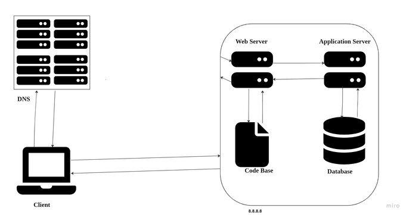

General overview: DNS lookup implements DNS query. DNS query can be of two types i.e. recursive or iterative. The Recursive DNS query deals with the best-case scenario and the Iterative DNS query deals with the worst-case scenario.

Detailed overview: When a user types in the address www.foobar.com, the browser looks up in its cache if it has the IP address stored, if not it queries the OS's cache. If not present in either cache, the OS calls the DNS resolver, which queries the root, and the root server redirects the resolver to the Top Level Domain server corresponding to the domain foobar.com. Then the TLD server redirects the resolver to the Named authority registrant associated with foobar.com. This register contains the IP address of the domain www.foobar.com. The resolver stores this IP address for future use and then returns to the browser the corresponding IP address in this case being 8.8.8.8
Through the TCP/IP protocol the browser sends out an HTTP request to the server located at address 8.8.8.8, This server contains a web server instance, an Application server instance the codebase, and the database.
The Web server is always listening for requests on HTTP port 80. Once it receives the request from the user's web browser. The web server serves up a response containing the requested service (i.e. web page) or an error if a failure occurs. If the requested resource is a static page, the web server serves it up as is. If the requested resource is dynamic content. The Web server transfers the request to the application server which might query the database and returns the response to the Web server which in turn returns the webpage to the user's web browser.

SPOF
With a single server as our main gateway to the service. When it fails for any reason then the whole website is down. Hence this is a single point of failure.

DOWNTIME
With this configuration any time we need t update the code base, database, or application server code. There has to be a shut-off of the system. Therefore during database migration, features updates, and patches to the software the web server has to be restarted therefore taking the website out of commission during the duration

SCALING
When the load becomes too much for the single server or the number of hits on the server increase. It is impossible to scale this configuration horizontally i.e. increase the nodes in a load balancer cluster server configuration since there is no cluster present.
Hence the only scalability in this configuration is vertical scalability which deals with increasing the current system capability e.g. CPU power, RAM e.t.c This scalability while expensive is also time-consuming as the service needs to be offline.

The domain name for our website is foobar.com. The subdomain for our website and the address users will use is www.foobar.com So in our DNS record, we introduce a CNAME record of the subdomain www.foobar .com that points to the domain name foobar.com
Then an A record pointing the domain name foobar.com to the IP address 8.8.8.8
i.e www.foobar.com CNAME foobar.com foobar.com A 8.8.8.8
